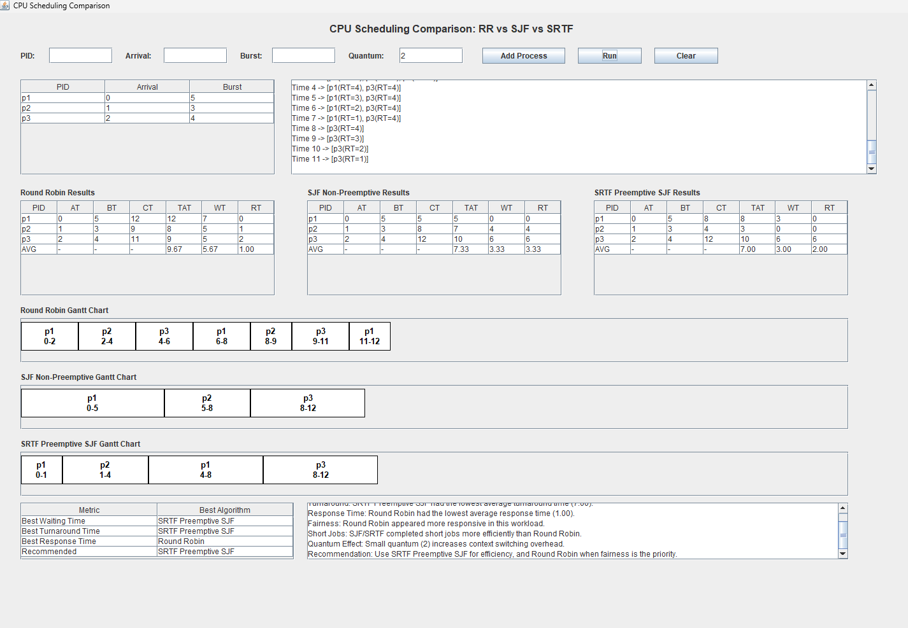
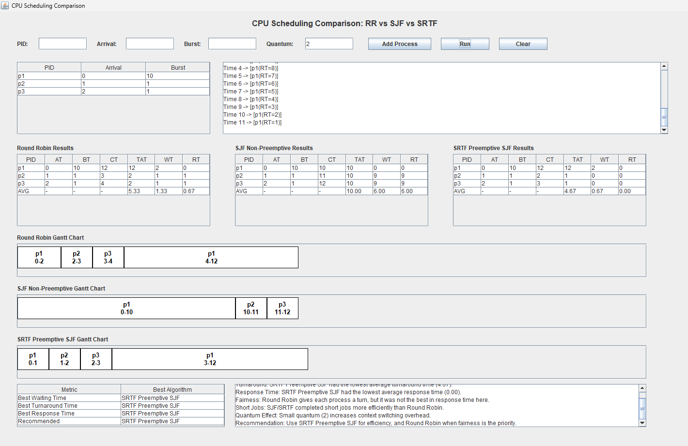
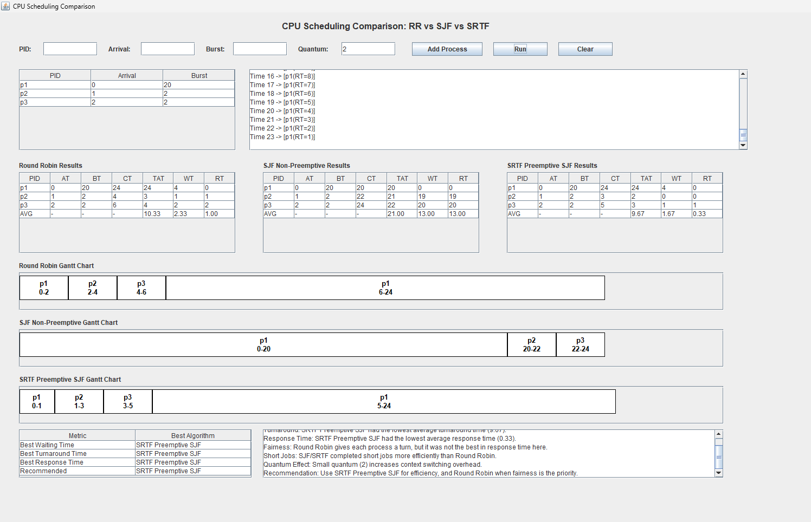

# CPU Scheduling Comparison Project

## Team Information

- Project Title: Round Robin vs SJF Comparison Project
- Repository URL: https://github.com/behery10/CPU-Scheduling-Comparison

## Team Members

| Member Name | Student ID |
|---|---|
| إبراهيم محمد إسماعيل عبدالخالق بحيري | 20240011 |
| أحمد محمد عبدالرحمن إبراهيم عبدربه | 20240027 |
| عبدالرحمن ياسر سمير إبراهيم | 20240566 |
| حليله محمد محسن زكي | 20240282 |
| نوران طلعت عبدالنعم | 20241073 |
| أسماء محمد عبدالحكيم | 20240127 |

---

## Project Overview

This project was developed for the Operating Systems course to compare CPU scheduling algorithms using a Java GUI application.

The system allows the user to enter processes dynamically, run multiple scheduling algorithms, and compare their performance using common scheduling metrics.

---

## Implemented Algorithms

The project implements and compares the following algorithms:

1. Round Robin (RR)
2. Shortest Job First (SJF - Non-Preemptive)
3. Shortest Remaining Time First (SRTF - Preemptive SJF)

---

## Project Features

- Dynamic process input using PID, Arrival Time, and Burst Time
- Time Quantum input for Round Robin
- Input validation for invalid values and duplicate process IDs
- Separate result tables for each algorithm
- Visual Gantt Chart for each algorithm
- Ready Queue display
- Average Waiting Time, Turnaround Time, and Response Time
- Comparison summary showing the best algorithm for each metric
- Dynamic conclusion based on the actual results
- Idle CPU time handling in the Gantt Chart
- Scenario buttons for loading predefined test cases automatically

---

## Scheduling Metrics

The project calculates:

- Completion Time (CT)
- Turnaround Time (TAT)
- Waiting Time (WT)
- Response Time (RT)

---

## How to Run

1. Open the project in a Java IDE such as NetBeans, IntelliJ IDEA, or Eclipse.
2. Open the file: `src/gui/MainFrame.java`
3. Run the `MainFrame` class.
4. Enter the process data and quantum value.
5. Click **Run** to display the scheduling results.
6. You can also click Scenario buttons to load predefined test cases automatically.

---

## Test Scenarios

The project also includes scenario buttons in the GUI to load predefined test cases quickly.

---

# Scenario 1: Normal Workload

Quantum = 2

P1 → Arrival = 0, Burst = 5  
P2 → Arrival = 1, Burst = 3  
P3 → Arrival = 2, Burst = 4  

### Result
SRTF achieved the lowest waiting time.

---

# Scenario 2: Short Jobs

Quantum = 2

P1 → Arrival = 0, Burst = 10  
P2 → Arrival = 1, Burst = 1  
P3 → Arrival = 2, Burst = 1  

### Result
SJF/SRTF performed better for short jobs.

---

# Scenario 3: Long Job Sensitivity

Quantum = 2

P1 → Arrival = 0, Burst = 20  
P2 → Arrival = 1, Burst = 2  
P3 → Arrival = 2, Burst = 2  

### Result
Long process is delayed, showing starvation in SJF/SRTF.

---

# Scenario 4: Fairness

Quantum = 2

P1 → Arrival = 0, Burst = 10  
P2 → Arrival = 0, Burst = 10  
P3 → Arrival = 0, Burst = 10  

### Result
Round Robin distributes CPU time equally and appears more fair across all processes.

---

# Scenario 5: Input Validation

### Invalid Inputs

- Burst Time = -1
- Arrival Time = -2
- Duplicate PID
- Quantum = 0

### Result

The system correctly rejects invalid inputs and prevents invalid scheduling execution.

---

## Conclusion

This project demonstrates the difference between fairness-based and efficiency-based CPU scheduling algorithms.

Round Robin provides fair CPU distribution by giving each process a turn, while SJF and SRTF often reduce waiting time and turnaround time by prioritizing shorter jobs.

The comparison results show that:
- Round Robin improves fairness and response distribution.
- SJF and SRTF improve efficiency and reduce average waiting time.
- The selected quantum significantly affects Round Robin behavior and performance.

Overall, the project successfully compares different scheduling strategies using real execution scenarios and visual analysis.

---

## Course Information

- Course: Operating Systems
- Project Type: Scheduling Comparison Project
- Algorithms: Round Robin, SJF, SRTF
- Language: Java
- GUI Technology: Java Swing
